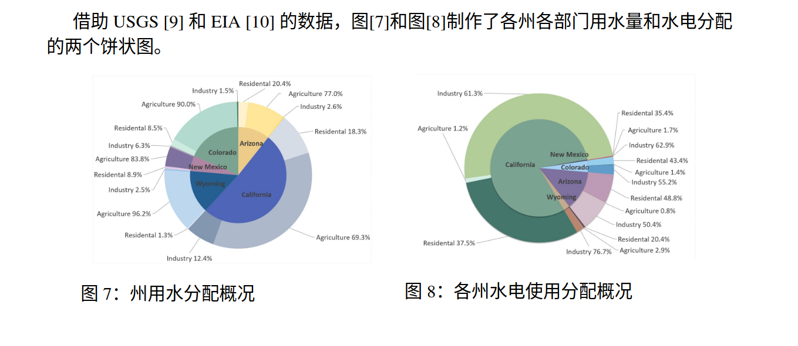

# 2200084

## 解法描述

​	题目对于使用水和发电水的分配问题值得学习，对于后面问题的解决使用了经济学专业知识，无法在短时间内学习，所以我们重点学习第一个模型的建立。

### 1. 模型一的解决思路：线性优化引入时间变化来模拟分配问题

​	模型一要解决的问题就是给定两个水库，一个在上游$D_1$，一个在下游$D_2$，每个水库的水有两个用途：

- 用来发电，供给5个州，这五个州表示为$A_{i},(i=1,2,3,4,5)$
- 给5个州正常用水

然后题目给出初始的水位高度：
$$
D_1 \rightarrow P \\
D_2 \rightarrow M
$$
需要我们回答，如果在每日需求不变（电和水）的情况下，我们的策略可以维持多久的正常供水。

首先我们要自己查询的东西是：

- $d_j^{water},d_j^{power},(j=1,2,3,4,5)$，即州$A_j$需要日用水和需要的电是多少。**二者单位不同。**
- $\alpha_{ij},\gamma_{ij},(i=1,2;j=1,2,3,4,5)$，即$D_i$向$A_j$运输的水的效率和电的效率，就是实际用户用到的电和产生的电的比例。
- $v_f=0$，$v_f$是上游的$D_1$每日流入的水量，在这里是0。
- $S_i,(i=1,2)$，即$D_i$的底面积，**这里题目把水库当作圆柱**。
- $\beta_i,(i=1,2)$，即$D_i$的发电机的效率，就是把重力势能转化为电势能的效率。
- $h^{lowest}_{i},(i=1,2)$，表示水库$D_i$的最低发电水位，如果低于这个水位，就无法发电。

我们要求解的变量即：

- $v^{t}_{ij},(i=1,2;j=1,2,3,4,5;t=0,1,2,\dots)$，表示第$t$天从$D_i$流到$A_j$的日用水量。单位为$m^3$。
- $u_{ij}^{t}$，表示第$t$天从$D_i$流到$A_j$的发电水量。单位为$m^3$。
- $h_i^t,(i=1,2)$，表示第$t$天的两个水库的水位高度。

此时的关系有：

- 两个水库的流量守恒：

对于$D_1$:
$$
\begin{align}

S_1(h_1^{t+1}-h_1^{t})&=-\sum_{j=1}^5 (\alpha_{1j}v_{1j}^t+u_{1j}^t)+v_f \\
&\Rightarrow -\sum_{j=1}^5 (\alpha_{1j}v_{1j}^t+u_{1j}^t)

\end{align}
$$
对于$D_2$:
$$
S_2(h_2^{t+1}-h_2^{t})=-\sum_{j=1}^5 (\alpha_{2j}v_{2j}^t+u_{2j}^t) + \sum_{j=1}^5 u_{1j}^t
$$

- 供需平衡：

即两个水库的日用水供应量和每日需求量要平衡。

用水：
$$
\sum_{i=1}^2\alpha_{ij}v_{ij}^t=d_j^{water}
$$
用电：

这里首先要根据能量守恒求出发电公式：
$$
W_{ij}=\beta_{i}\rho^{water}g\cdot{h_{i}^t + h_{i}^{t+1}\over 2}\cdot u_{ij}^t\cdot I_{[h_i^t\ge h_i^{lowest}]}
$$
再考虑运输损耗：
$$
\sum_{i=1}^2 \gamma_{ij}\beta_{i}\rho^{water}g\cdot{h_{i}^t + h_{i}^{t+1}\over 2}\cdot u_{ij}^t\cdot I_{[h_i^t\ge h_i^{lowest}]}=d_j^{power}
$$

- 常规：

$$
v_{ij}^t,u_{ij}^t \ge 0 \\
h_i^t\ge 0
$$

我们的优化目标是：
$$
\min_{v_{ij}^t,u_{ij}^t} \sum_{i=1}^2\sum_{i=1}^5 (v_{ij}^t+u_{ij}^t), (i=1,2;j=1,2,3,4,5)
$$
约束条件是：
$$
v_{ij}^t,u_{ij}^t \ge 0 \\
h_i^t\ge 0  \\
d_j^{water} = \sum_{i=1}^2\alpha_{ij}v_{ij}^t \\
d_j^{power}= \gamma_{1j}\beta_{1}\rho^{water}g\cdot[h_{1}^t - {1\over 2S_1} \sum_{j=1}^5 (\alpha_{1j}v_{1j}^t+u_{1j}^t)]\cdot u_{1j}^t\cdot I_{[h_1^t\ge h_1^{lowest}]}
+ \\ \gamma_{2j}\beta_{2}\rho^{water}g\cdot[h_{2}^t -{1\over 2S_2}(\sum_{j=1}^5 (\alpha_{2j}v_{2j}^t+u_{2j}^t) + \sum_{j=1}^5 u_{1j}^t) ]\cdot u_{2j}^t\cdot I_{[h_2^t\ge h_2^{lowest}]}
$$
这时我们通过求解之后可以的到对应的$v_{ij}^t,u_{ij}^t$，然后就可以根据前面的流量守恒更新$h_i^{t+1}$，进行下一轮迭代，知道优化问题无解，则停止，表明已经无法满足我们的约束。其中:
$$
h_1^0=P;h_2^0=M
$$

## 问题

### 1. 解决优化问题

#### [zt] 我们给定如下几组$P,M$​的值，然后需要得到：

- $v^{t}_{ij},(i=1,2;j=1,2,3,4,5;t=0,1,2,\dots)$，表示第$t$天从$D_i$流到$A_j$的日用水量。单位为$m^3$。
- $u_{ij}^{t}$，表示第$t$天从$D_i$流到$A_j$的发电水量。单位为$m^3$。
- $h_i^t,(i=1,2)$，表示第$t$天的两个水库的水位高度。

初始数据如下：

|       | $h_i^{lowest}$ | 平均情况 | 最好情况 |
| ----- | -------------- | -------- | -------- |
| $h_1$ | 110m           | 142m     | 216m     |
| $h_2$ | 119m           | 158m     | 221m     |

的出数据之后填入Excel表格

#### [ly] 可视化

这里并不需要上面的东西。

- 这里设计两层分配的饼图。

- 两层分配的桑基图。

