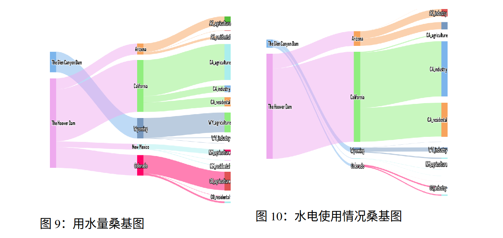

## 图7，图8 州用水分配概况，各州水电使用分配概况


### 分析与方法

这两个图应该是旭日图，可以直接用两个拼图来画，但更为简单的做法是直接画旭日图

这里可以使用**Pyecharts库**中的`Sunburst`类，也可以使用**plotly**：

#### [Pyecharts库](https://05x-docs.pyecharts.org/#/zh-cn/prepare)

> Pyecharts 是一个基于 ECharts 的 Python 数据可视化库，它允许用户使用 Python 语言生成各种类型的交互式图表和数据可视化。
>
> ECharts 是一个使用 JavaScript 实现的开源可视化库，而 Pyecharts 则是 ECharts 的 Python 封装，使得在 Python 中使用 ECharts 变得更加方便。
>
> Pyecharts 提供了一组简单而灵活的 API，使用户能够轻松地创建各种图表，包括但不限于折线图、柱状图、散点图、饼图、地图等。
>
> 通过 pyecharts，用户可以使用 Python 语言处理和准备数据，然后使用简洁的代码生成交互式的图表，这些图表可以嵌入到 Web 应用程序中或保存为静态文件。
>
> <font color=Red>之前学java，用过Echarts，对这个还是比较熟悉</font>
>
> 缺点是要生成网页打开，优点是比较简单而且图形生成灵活


```python
from pyecharts import options as opts
from pyecharts.charts import Sunburst

data = {
    "name": "root",
    "children": [
        {"name": "A", "value": 10},
        {"name": "B", "value": 20},
        {"name": "C", "value": 15},
        {"name": "D", "value": 25},
    ],
}

sunburst = Sunburst()
sunburst.add("", data['children'], radius=[0, "90%"])
sunburst.set_global_opts(title_opts=opts.TitleOpts(title="基本旭日图"))
sunburst.render("basic_sunburst.html")
```


#### [Plotly](https://plotly.com/python/)

> plotly 的 Python 软件包是一个开源的代码库，它基于 plot.js，而后者基于 d3.js。我们实际使用的则是一个对 plotly 进行封装的库，名叫 cufflinks，它能让你更方便地使用 plotly 和 Pandas 数据表协同工作。
>
> 可绘制多种图形，比如柱状图、饼图、直方图、饼图、气泡图、桑基图、股票图、旭日图、联合分布图、地图


```python
import plotly.express as px
data = dict(
    character=["Eve", "Cain", "Seth", "Enos", "Noam", "Abel", "Awan", "Enoch", "Azura"],
    parent=["", "Eve", "Eve", "Seth", "Seth", "Eve", "Eve", "Awan", "Eve" ],
    value=[10, 14, 12, 10, 2, 6, 6, 4, 4])

fig = px.sunburst(
    data,
    names='character',
    parents='parent',
    values='value',
)
fig.show()
```


### 实现

#### 1. 使用PyeCharts

有一说一，这个感觉用html+echarts.js还简单点，用python感觉还是不太熟，这个麻烦就是还要生成html才能打开，这个图像大小还不好调，导致这个标题被盖着，😓


#### 2.使用Plotly

这个要注意有重复的labels，要用ids来区分，还有这个加注释有点不好加，就是那些指出来的线，因为Plotly本身没有支持Sunburst图将标签移到外部并添加引导线的功能。目前我还没找到解决办法😀


## 图9、10 桑基图




桑基图(Sankey diagram)，即桑基能量分流图，也叫桑基能量平衡图。它是一种特定类型的流程图，图中延伸的分支的宽度对应数据流量的大小，通常应用于能源、材料成分、金融等数据的可视化分析。因1898年Matthew Henry Phineas Riall Sankey绘制的"蒸汽机的能源效率图"而闻名，此后便以其名字命名为"桑基图"。


桑基图就是一种流程图，核心在于展示数据的流转，其实就是数据的分类，每个数据会分成什么。


这个同样可以用`Pyecharts`和`Plotly`这两种方法

### 实现

两个方法都还比较简单

#### 1. 使用PyeCharts


#### 2.使用Plotly


颜色就不加了


<font size=5 color=Red> 注：代码我就不粘了，直接看python代码就行</font>

