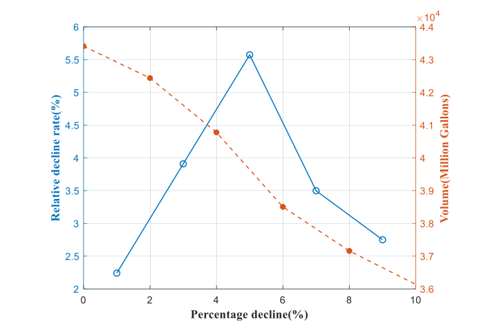

# 2202784

## 原文解题思路

​	原文第一问其实和2200084的思路是差不多的，只是这篇论文并不是简单地把水库的水位和容量的关系建模成简单圆柱，而是通过往年数据利用多项式拟合出关系。另外对于水电转化的部分也略有不同。其余都是差不多的。

​	这里的第二问，就是关于各方利益平衡的部分，对`社会，经济，生态`三个目标，进行了量化分析，这里简略说一下：

### 1. 社会影响函数

#### 目标函数
$$
 \max f_1(x) = -\min \sum_{m=1}^{2} \sum_{k=1}^{3} \sum_{j=1}^{5} \left[ D_j^{km} - \sum_{i=1}^{I(m)} x_{ij}^{km} \right] 
$$

#### 变量和参数解释

##### 1. $D_j^{km}$
- **含义**：表示第 $j$ 州对第 $k$ 类用户（工业、农业或居民）的第 $m$ 种资源（水或电）的需求。
- **示例**：
  - $D_j^{11}$ 表示第 $j$ 州工业用水需求。
  - $D_j^{21}$ 表示第 $j$ 州农业用水需求。
  - $D_j^{31}$ 表示第 $j$ 州居民用水需求。
  - $D_j^{12}$ 表示第 $j$ 州工业用电需求。
  - $D_j^{22}$ 表示第 $j$ 州农业用电需求。
  - $D_j^{32}$ 表示第 $j$ 州居民用电需求。

##### 2. $x_{ij}^{km}$
- **含义**：表示从第 $i$ 个水源（或电源）向第 $j$ 州的第 $k$ 类用户提供的第 $m$ 种资源（水或电）的数量。
- **示例**：
  - $x_{1j}^{11}$ 表示从格伦峡谷大坝（$i = 1$）向第 $j$ 州工业用户供水的数量。
  - $x_{2j}^{21}$ 表示从胡佛大坝（$i = 2$）向第 $j$ 州农业用户供水的数量。
  - $x_{3j}^{31}$ 表示从降雨（$i = 3$）向第 $j$ 州居民用户供水的数量。
  - $x_{1j}^{12}$ 表示从格伦峡谷大坝（$i = 1$）向第 $j$ 州工业用户供电的数量。
  - $x_{2j}^{22}$ 表示从胡佛大坝（$i = 2$）向第 $j$ 州农业用户供电的数量。
  - $x_{3j}^{32}$ 表示从降雨（$i = 3$）向第 $j$ 州居民用户供电的数量。

#### 3. $I(m)$
- **含义**：表示第 $m$ 种资源（水或电）的来源数量。
- **示例**：
  - 对于水（$m = 1$），$I(1) = 3$，即格伦峡谷大坝、胡佛大坝和降雨。
  - 对于电（$m = 2$），$I(2) = 2$，即格伦峡谷大坝和胡佛大坝。

#### 参数获取方式

##### 1. 需求数据 $D_j^{km}$
- **来源**：通过历史数据、统计报告和调查问卷等方式收集各州不同用户的用水和用电需求数据。
- **示例**：水务部门和电力公司提供的年度用水和用电统计数据。

##### 2. 供给数据 $x_{ij}^{km}$
- **来源**：通过实时监测和预测模型获取各水源和电源的实际供给数据。
- **示例**：水库管理系统的实时水位数据、水电站的发电量数据等。

#### 目标函数解释

目标函数 $f_1(x)$ 的目的是最小化供需之间的差距，从而最大化社会效应。具体来说：

$$
 \max f_1(x) = -\min \sum_{m=1}^{2} \sum_{k=1}^{3} \sum_{j=1}^{5} \left[ D_j^{km} - \sum_{i=1}^{I(m)} x_{ij}^{km} \right] 
$$

- **内层求和**：计算每个州、每类用户、每种资源的供需差值。
- **外层求和**：将所有供需差值加总。
- **取负号**：确保目标是最小化供需差值，从而最大化社会效应。

#### 示例

假设某州的工业用水需求为 $D_j^{11} = 100$ 单位，实际供水量为 $x_{1j}^{11} + x_{2j}^{11} + x_{3j}^{11} = 90$ 单位，则供需差值为 $100 - 90 = 10$ 单位。

通过这种方式，可以量化并优化整个系统中的供需平衡，从而最大化社会效应。

### 2. 经济效应

#### 目标函数
$$
 \max f_2(x) = \max \sum_{m=1}^{2} \sum_{k=1}^{3} \sum_{j=1}^{5} \sum_{i=1}^{I(m)} (b_{ij}^{km} - c_{ij}^{km}) x_{ij}^{km} \chi_{ij}^{m} \delta_{j}^{km} w_{j}^{m} 
$$

##### 变量和参数解释

###### 1. $b_{ij}^{km}$
- **含义**：表示第 $i$ 个水源（或电源）向第 $j$ 州的第 $k$ 类用户提供的第 $m$ 种资源（水或电）的收益系数。
- **示例**：
  - $b_{1j}^{11}$ 表示格伦峡谷大坝向第 $j$ 州工业用户供水的收益系数。
  - $b_{2j}^{21}$ 表示胡佛大坝向第 $j$ 州农业用户供水的收益系数。

###### 2. $c_{ij}^{km}$
- **含义**：表示第 $i$ 个水源（或电源）向第 $j$ 州的第 $k$ 类用户提供的第 $m$ 种资源（水或电）的成本系数。
- **示例**：
  - $c_{1j}^{11}$ 表示格伦峡谷大坝向第 $j$ 州工业用户供水的成本系数。
  - $c_{2j}^{21}$ 表示胡佛大坝向第 $j$ 州农业用户供水的成本系数。

###### 3. $x_{ij}^{km}$
- **含义**：表示从第 $i$ 个水源（或电源）向第 $j$ 州的第 $k$ 类用户提供的第 $m$ 种资源（水或电）的数量。
- **示例**：
  - $x_{1j}^{11}$ 表示从格伦峡谷大坝向第 $j$ 州工业用户供水的数量。
  - $x_{2j}^{21}$ 表示从胡佛大坝向第 $j$ 州农业用户供水的数量。

###### 4. $\chi_{ij}^{m}$
- **含义**：表示第 $i$ 个水源（或电源）向第 $j$ 州提供第 $m$ 种资源（水或电）的顺序系数，反映了不同水源的优先级。
- **示例**：
  - $\chi_{1j}^{1}$ 表示格伦峡谷大坝向第 $j$ 州供水的顺序系数。
  - $\chi_{2j}^{2}$ 表示胡佛大坝向第 $j$ 州供电的顺序系数。

###### 5. $\delta_{j}^{km}$
- **含义**：表示第 $j$ 州的第 $k$ 类用户对第 $m$ 种资源（水或电）的公平性系数，确保资源分配的公平性。
- **示例**：
  - $\delta_{j}^{11}$ 表示第 $j$ 州工业用水的公平性系数。
  - $\delta_{j}^{21}$ 表示第 $j$ 州农业用水的公平性系数。

###### 6. $w_{j}^{m}$
- **含义**：表示第 $j$ 州对第 $m$ 种资源（水或电）的区域权衡系数，反映不同地区的需求差异。
- **示例**：
  - $w_{j}^{1}$ 表示第 $j$ 州对水的需求权衡系数。
  - $w_{j}^{2}$ 表示第 $j$ 州对电的需求权衡系数。

##### 参数获取方式

###### 1. 收益系数 $b_{ij}^{km}$
- **来源**：通过历史数据、统计报告和调查问卷等方式收集各州不同用户的用水和用电收益数据。
- **示例**：水务部门和电力公司提供的年度用水和用电收益统计数据。

###### 2. 成本系数 $c_{ij}^{km}$
- **来源**：通过实时监测和预测模型获取各水源和电源的实际成本数据。
- **示例**：水库管理系统的运营成本数据、水电站的发电成本数据等。

###### 3. 供给数量 $x_{ij}^{km}$
- **来源**：通过实时监测和预测模型获取各水源和电源的实际供给数据。
- **示例**：水库管理系统的实时水位数据、水电站的发电量数据等。

###### 4. 顺序系数 $\chi_{ij}^{m}$
- **来源**：根据距离和优先级设定。
- **示例**：距离较近的水源优先级较高。

###### 5. 公平性系数 $\delta_{j}^{km}$
- **来源**：通过社会调查和政策制定确定。
- **示例**：确保不同用户群体之间的公平分配。

###### 6. 区域权衡系数 $w_{j}^{m}$
- **来源**：通过历史需求数据和政策导向确定。
- **示例**：根据各州的历史需求和未来规划设定。

##### 目标函数解释

目标函数 $f_2(x)$ 的目的是最大化经济效应。具体来说：

$$
 \max f_2(x) = \max \sum_{m=1}^{2} \sum_{k=1}^{3} \sum_{j=1}^{5} \sum_{i=1}^{I(m)} (b_{ij}^{km} - c_{ij}^{km}) x_{ij}^{km} \chi_{ij}^{m} \delta_{j}^{km} w_{j}^{m} 
$$

- **内层求和**：计算每个州、每类用户、每种资源的收益减去成本后的净收益。
- **外层求和**：将所有净收益加总。
- **乘以系数**：确保资源分配的顺序、公平性和区域权衡。

##### 示例

假设某州的工业用水需求为 $D_j^{11} = 100$ 单位，实际供水量为 $x_{1j}^{11} + x_{2j}^{11} + x_{3j}^{11} = 90$ 单位，收益系数 $b_{1j}^{11} = 2$，成本系数 $c_{1j}^{11} = 1$，顺序系数 $\chi_{1j}^{1} = 1$，公平性系数 $\delta_{j}^{11} = 1$，区域权衡系数 $w_{j}^{1} = 1$，则净收益为：

$$
 (2 - 1) \times 90 \times 1 \times 1 \times 1 = 90 
$$

通过这种方式，可以量化并优化整个系统中的经济效益，从而最大化经济效应。

### 3. 生态影响

#### 目标函数
$$
 \max f_3(x) = -\min \sum_{k=1}^{3} \sum_{j=1}^{5} d_j^k p_j^k \sum_{i=1}^{I(m)} x_{ij}^k 
$$

##### 变量和参数解释

###### 1. $d_j^k$
- **含义**：表示第 $j$ 州的第 $k$ 类用户（工业、农业或居民）排放的污染物含量（单位：mg/L）。
- **示例**：
  - $d_j^1$ 表示第 $j$ 州工业用户的污染物含量。
  - $d_j^2$ 表示第 $j$ 州农业用户的污染物含量。
  - $d_j^3$ 表示第 $j$ 州居民用户的污染物含量。

###### 2. $p_j^k$
- **含义**：表示第 $j$ 州的第 $k$ 类用户（工业、农业或居民）的污染物排放系数。
- **示例**：
  - $p_j^1$ 表示第 $j$ 州工业用户的污染物排放系数。
  - $p_j^2$ 表示第 $j$ 州农业用户的污染物排放系数。
  - $p_j^3$ 表示第 $j$ 州居民用户的污染物排放系数。

###### 3. $x_{ij}^k$
- **含义**：表示从第 $i$ 个水源向第 $j$ 州的第 $k$ 类用户提供的水量。
- **示例**：
  - $x_{1j}^1$ 表示从格伦峡谷大坝向第 $j$ 州工业用户供水的数量。
  - $x_{2j}^2$ 表示从胡佛大坝向第 $j$ 州农业用户供水的数量。
  - $x_{3j}^3$ 表示从降雨向第 $j$ 州居民用户供水的数量。

##### 参数获取方式

###### 1. 污染物含量 $d_j^k$
- **来源**：通过水质监测数据获取各州不同用户的污染物含量。
- **示例**：环保部门提供的水质检测报告，特别是针对COD、BOD等重要污染物的数据。

###### 2. 污染物排放系数 $p_j^k$
- **来源**：通过历史数据、统计报告和调查问卷等方式收集各州不同用户的污染物排放系数。
- **示例**：水务部门和环保部门提供的年度污染物排放统计数据。

###### 3. 供给数量 $x_{ij}^k$
- **来源**：通过实时监测和预测模型获取各水源的实际供给数据。
- **示例**：水库管理系统的实时水位数据、水电站的发电量数据等。

##### 目标函数解释

目标函数 $f_3(x)$ 的目的是最小化生态效应。具体来说：

$$
\max f_3(x) = -\min \sum_{k=1}^{3} \sum_{j=1}^{5} d_j^k p_j^k \sum_{i=1}^{I(m)} x_{ij}^k
$$

- **内层求和**：计算每个州、每类用户、每种资源的污染物排放总量。
- **外层求和**：将所有污染物排放总量加总。
- **取负号**：确保目标是最小化污染物排放总量，从而最大化生态效应。

##### 示例

假设某州的工业用水需求为 $D_j^{11} = 100$ 单位，实际供水量为 $x_{1j}^{11} + x_{2j}^{11} + x_{3j}^{11} = 90$ 单位，污染物含量 $d_j^1 = 5$ mg/L，污染物排放系数 $p_j^1 = 0.8$，则污染物排放总量为：
$$
5 \times 0.8 \times 90 = 360 
$$

通过这种方式，可以量化并优化整个系统中的污染物排放，从而最大化生态效应。

## 问题

### 1. [ly] 双边图：

​	在表示两个变量在同一自变量上的变化的时候，可以使用这种图，比较清晰，数据可以用GPT生成，注意座标轴刻度向内：

