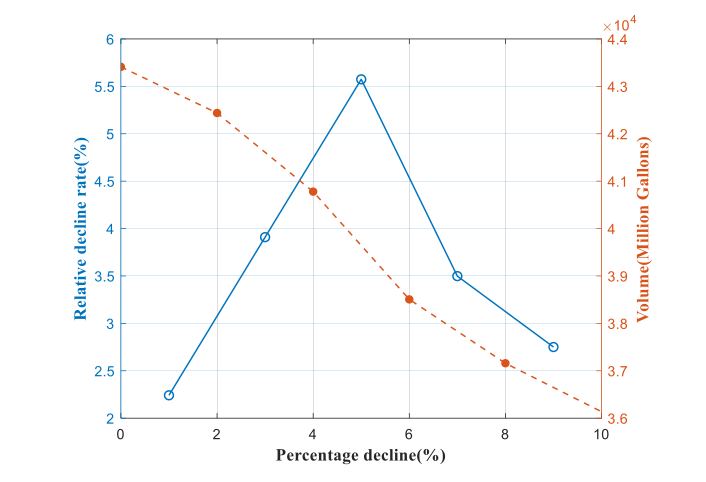

### 双边图




#### 实现

```python
import matplotlib.pyplot as plt

# 数据

percentage_decline1 = [1, 3, 5, 7, 9]
percentage_decline2 = [0, 2, 4, 6, 8, 10]
relative_decline_rate = [2.25, 3.9, 5.5, 3.5, 2.75]
volume = [4.35, 4.25, 4.08, 3.85, 3.72, 3.6]

volume = [i * 10 ** 4 for i in volume]
# 字体设置（使用加载的本地字体）
plt.rcParams['font.family'] = 'Times New Roman'
plt.rcParams['mathtext.fontset'] = 'stix'
plt.rcParams['font.size'] = 15
plt.rcParams['xtick.labelsize'] = 9
plt.rcParams['ytick.labelsize'] = 9


# 创建图表
fig, ax1 = plt.subplots()
plt.xlim(0,10)
# 绘制左侧Y轴
color = 'tab:blue'
ax1.set_xlabel('Percentage decline(%)')
ax1.set_ylabel('Relative decline rate(%)', color=color)
ax1.plot(percentage_decline1, relative_decline_rate, 'o-', color=color, markerfacecolor='none')
ax1.tick_params(axis='y', labelcolor=color)
#显示网格
ax1.grid()

ax1.set_ylim(2,6)

# 创建右侧Y轴
ax2 = ax1.twinx()
color = 'tab:red'
ax2.set_ylabel('Volume(Million Gallons)', color=color)
ax2.plot(percentage_decline2, volume, 'o--', color=color)
ax2.tick_params(axis='y', labelcolor=color)
# 科学计数法, useMathText=True表示使用数学符号，而不是1e4这样的形式
ax2.ticklabel_format(axis='y', style='sci', scilimits=(0, 0),useMathText=True)
# 设置科学计数法的偏移量
offsetText = ax2.yaxis.get_offset_text()
offsetText.set_horizontalalignment('left')
offsetText.set_x(1.025)


# 设置Y轴范围
ax2.set_ylim(3.6 * 10 ** 4, 4.4 * 10 ** 4)

# 调整布局并显示
fig.tight_layout()
plt.show()

```


#### 结果

