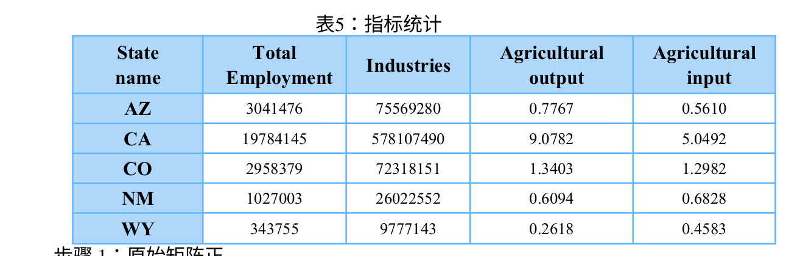

# 2207864 

## 文章背景 

​	本篇文章在美观方面一言难尽，属于我最近看到的论文里面最丑的一篇，而且方法十分朴素。但是它又一个极大的亮点就是思路很好，就是让人觉得十分合理，并且对每一个参数的数据都进行了严格的指派，而不是像之前几篇论文里面只给出数据源甚至不告知具体参数。我猜测评委可能想法和这篇文章非常契合，因此被评选为O将论文。因此这是一篇很值得仔细阅读的文章。

​	其思路如下：

- 第一问和其它几篇差不多
- 对于第二问，它使用TOPSIS+熵权法来对供供水对于工业和农业的影响，评分高的州优先供水，同时分三个缺水阶段进行讨论。（但是事实上它问得是电力和日常之间的冲突，就是如果水不够应该先满足谁，这里它对于问题的回答文不对题）
- 对于问题三，通过提供一些节水或者可持续的措施来减少水量，这个比较开放，只要最后措施使得在模型的运行下更加持久地运转就可以。
- 对于问题四，文章写得很简略，也不知道在放什么jb屁。

## 问题

### [zt] TOPSIS+熵权法解决州之间的优先供应问题

​	这里需要获得每个州的经济分数。这里给出原始指标：

需要通过熵权法进行权重分配，然后根据TOPSIS得出每个州的评分。