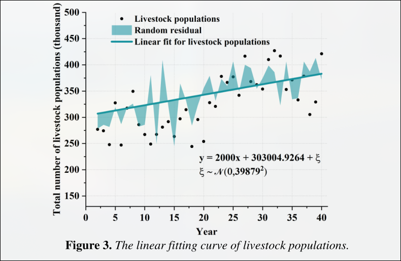

# 2300136

## 背景描述

马赛马拉国家保护区（Maasai Mara National Reserve）是肯尼亚的一个重要野生动物栖息地，以其丰富的生物多样性和壮丽的自然景观而闻名。然而，随着人类活动的增加，特别是旅游业和畜牧业的发展，该地区面临着诸多挑战，包括野生动物数量的减少、自然资源的退化以及人与动物之间的冲突加剧。为了实现保护区的可持续发展，需要制定出能够平衡保护野生动物、维护自然资源、满足当地居民经济需求并减少游客对野生动物负面影响的政策。为了解决这些问题，我们开发了一个基于网络的评估模型，旨在找到在不同土地类型中实现最佳长期效果的最优政策组合。这个模型考虑了四个关键方面：野生动物保护、自然资源保护、当地居民的经济利益以及动物与游客之间的互动。根据这些目标，我们设计了不同的政策选项，并通过数学规划的方法来寻找最优解。

## 问题

### 问题1：定义模型结构和变量

**任务描述**：
基于文件内容，构建一个用于优化马赛马拉保护区管理策略的数学模型框架，并明确模型中的决策变量、参数和目标函数。

- **决策变量**：
  - $x_{ij}$：表示第$i$个土地类型的第$j$种政策选择（0或1），其中$i = 1,2,3$代表三种土地类型（核心野生动物保护区、人类居住区和牲畜放牧区），$j = 1,2,...,8$代表每种土地类型的八种可能的政策组合.
  
- **参数**：
  - $w_k$：表示第$k$个目标的权重，$k = 1,2,3,4$分别对应于野生动物保护、自然资源保护、当地居民经济利益和动物与游客互动的目标.
  - $P_i$、$R_i$、$F_i$、$T_i$：分别是第$i$个土地类型下关于野生动物保护、自然资源保护、当地居民经济利益和动物与游客互动的得分.

- **目标函数**：
  $$
  \max \sum_{i=1}^{3} \left( w_1 \cdot P_i + w_2 \cdot R_i + w_3 \cdot F_i + w_4 \cdot T_i \right)
  $$

- **约束条件**：
  - 每个土地类型只能选择一种政策组合：
    $$
    \sum_{j=1}^{8} x_{ij} = 1, \quad \forall i = 1,2,3
    $$
  - 变量取值范围：
    $$
    x_{ij} \in \{0, 1\}, \quad \forall i = 1,2,3, \quad \forall j = 1,2,...,8
    $$

**答案来源**：
- 文中提到，“我们提出三种不同的政策，测试了不同政策组合的交互作用，并将它们结合成八种场景.”（Page 2 of 25）
- 文中还提到，“我们构建了一个网络评价模型来描绘马赛马拉保护区的情况.”（Page 1 of 25）

**相关图表**：
- **Figure 1**：展示了网络评价模型的流程图.（III. Model Design, Section 3.1）

---

### 问题2：确定权重设置方法

**任务描述**：
请使用层次分析法（Analytical Hierarchy Process, AHP）确定各目标的权重$w_k$.根据文献综述和实际情况设定各目标的权重.

**设问**：
请用层次分析法计算每个目标的权重，并解释为什么这种方法适合用来确定权重.

**答案来源**：
- 文中提到，“为了确定四个部分在不同土地类型中的权重，我们采用了层次分析法（AHP）来计算每个部分的具体参数.”（Page 1 of 25）

**相关图表**：
- **Table 1**：包含主要符号及其描述，对于构建优化模型非常有用.（II. Foundations of the Model, Section 2.2）

---

### 问题3：构建多目标决策模型并应用线性加权和法

**任务描述**：
使用线性加权和法（Weighted Sum Method）将多目标优化问题转化为单目标优化问题，并最大化所有土地类型的综合得分.

**设问**：
请用线性加权和法构建一个综合得分函数，并解释这种方法的优势和局限性.

**答案来源**：
- 文中提到，“通过将四个部分标准化后的得分相加，并分配相应的权重，我们得出了最终得分作为我们的目标函数.”（Page 1 of 25）

**相关图表**：
- **Table 2**：列出所有可能的政策组合及其对应的最终得分.（IV. Results and Discussion）

---

### 问题4：应用整数规划求解模型

**任务描述**：
由于我们的决策变量是二进制的，请采用整数规划方法来解决此问题，并找出每个土地类型的最优政策组合.

**设问**：
请使用整数规划方法求解模型，并简要介绍该方法的基本原理及其适用性.

**答案来源**：
- 文中提到，“我们假设没有预算限制，所有的政策选项都可以实施，包括多个选项的组合.”（Page 6 of 25）

**相关图表**：
- **Table 3**：推荐每个土地类型的最优政策组合.（IV. Results and Discussion）

---

### 问题5：探索启发式算法的应用

**任务描述**：
考虑到可能存在多个局部最优解，请考虑使用遗传算法（Genetic Algorithm）搜索全局最优解.

**设问**：
请选择遗传算法，并解释为什么它适合用于本问题的求解.请提供算法的关键步骤和预期结果.

**答案来源**：
- 文中提到，“为了最小化误差，我们在模型中引入随机残差以捕捉未观察到的异质性.”（Page 1 of 25）

**相关图表**：
- **Figure 3**：展示不同政策组合下的最终得分变化趋势的柱状图或折线图.（VII. Testing the Model）

---

### 问题6：结果展示与分析

**任务描述**：
制作表格列出所有可能的政策组合及其对应的最终得分，并推荐每个土地类型的最优政策组合.同时，使用柱状图或折线图展示不同政策组合下的最终得分变化趋势，以便直观地比较不同策略的效果.

**设问**：
请创建一个表格，列出所有可能的政策组合及其对应的最终得分，并提供推荐的每个土地类型的最优政策组合.此外，请使用图表展示不同政策组合下的最终得分变化趋势，并解释你的推荐理由.

**答案来源**：
- 文中提到，“我们预测了未来二十年内不同政策的长期效果，并选择了得分最高的政策作为最优政策.”（Page 1 of 25）

**相关图表**：
- **Table 2**：列出所有可能的政策组合及其对应的最终得分.（IV. Results and Discussion）
- **Figure 4**：展示不同政策组合下的最终得分变化趋势的柱状图或折线图.（IV. Results and Discussion）

---

### 问题7：讨论与反思

**任务描述**：
分析所得结果的意义，解释为什么所选的政策组合被认为是最优的，并讨论可能存在的局限性和未来改进的方向.

**设问**：
请对所得结果进行讨论，指出模型的优点和潜在的局限性，并提出未来研究或实践中的改进建议.

**答案来源**：
- 文中提到，“我们进行了敏感性分析，验证了模型的稳定性和鲁棒性，并调整了参数以适应其他保护区.”（Page 1 of 25）

**相关图表**：
- **Table 4**：敏感性分析的结果.（V. Sensitivity Analysis）
