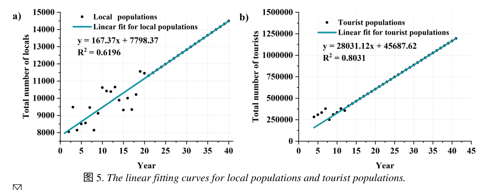

# 2300136

## 背景描述

​	马赛马拉国家保护区（Maasai Mara National Reserve）是肯尼亚的一个重要野生动物栖息地，以其丰富的生物多样性和壮丽的自然景观而闻名。然而，随着人类活动的增加，特别是旅游业和畜牧业的发展，该地区面临着诸多挑战，包括野生动物数量的减少、自然资源的退化以及人与动物之间的冲突加剧。为了实现保护区的可持续发展，需要制定出能够平衡保护野生动物、维护自然资源、满足当地居民经济需求并减少游客对野生动物负面影响的政策。为了解决这些问题，我们开发了一个基于网络的评估模型，旨在找到在不同土地类型中实现最佳长期效果的最优政策组合。这个模型考虑了四个关键方面：野生动物保护、自然资源保护、当地居民的经济利益以及动物与游客之间的互动。根据这些目标，我们设计了不同的政策选项，并通过数学规划的方法来寻找最优解。

## 假设和问题

### 1. 每个分数即$S_i$，是如何计算得到的？（统一讨论，不用做）

分析使用哪些作为数据，以及每个$S_i$是如何得到的。得到以下公式和图像：

#### 1.1. 野生动物保护：$S_1= {1\over 2}P+ {k \over 4\ln(k)} H'+ {D \over 4k} $ 

#### 1.2. 自然资源保护部门$S_2= S_{grass} + S_{water} $

#### 1.3. 经济部门$S_3= {1 \over {1+e^-{R_{rate} \over Q}}}$

#### 1.4. 旅游部分$S_4 = {(1-\lambda) + (1-\sigma) \over 2}$

### 2. AHP层次分析法确定评分[zt+ly]

- **假定**我们考虑四个方面：野生动物保护、自然资源保护、当地居民的经济利益、动物与游客之间的互动，由于各方面相互制约，譬如过度保护生态，可能会影响到当地的剧名生态。**问题**是如何确定一个分数来评判这几方面被做的好不好。
- 方法：AHP（层次分析法）
- 条件：四个方面的评判指标：$S_i(i=1,2,3,4)$，以及评判矩阵：

- 目标：

  - 解释权重矩阵怎么来的。有哪些方法可以确定权重矩阵。[zt]
  - 分数的计算公式。(文中3.1最后，以及Figure 7)[zt]
  - 各部分占比图。(Figure 7)[ly]

  

### 3. 对政策进行评分排序(不用做，很简单)

每个区提出3种，则每个区有$2^3=8$种政策，对于每种政策计算分数，排序得到每个区对应的治理政策。

### 4. 敏感性分析[ly]

看看这图怎么画的。

