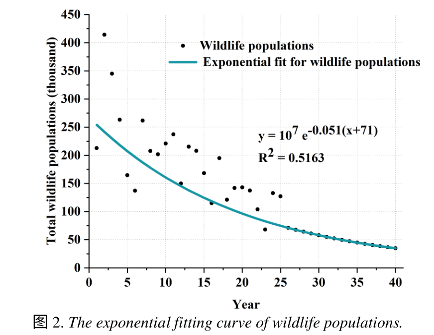
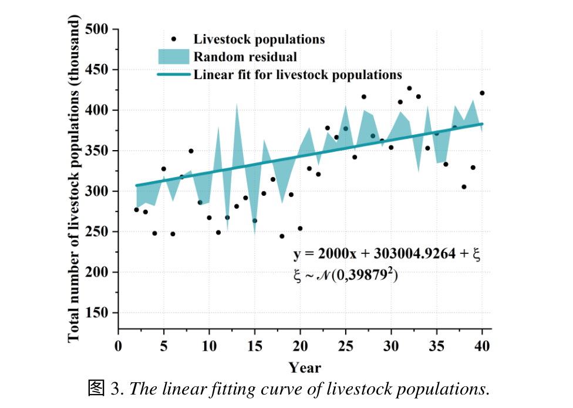
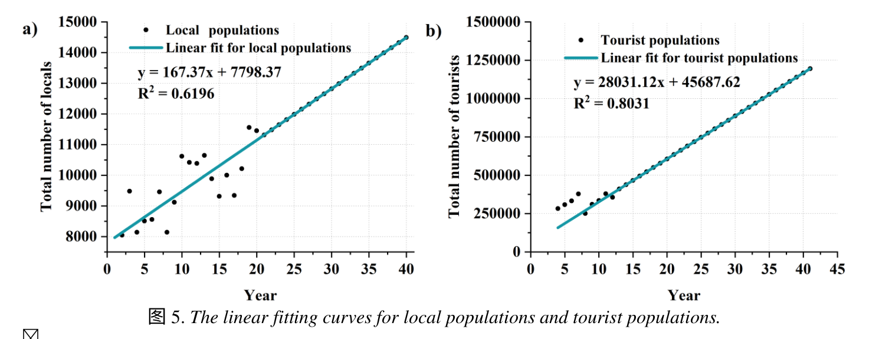
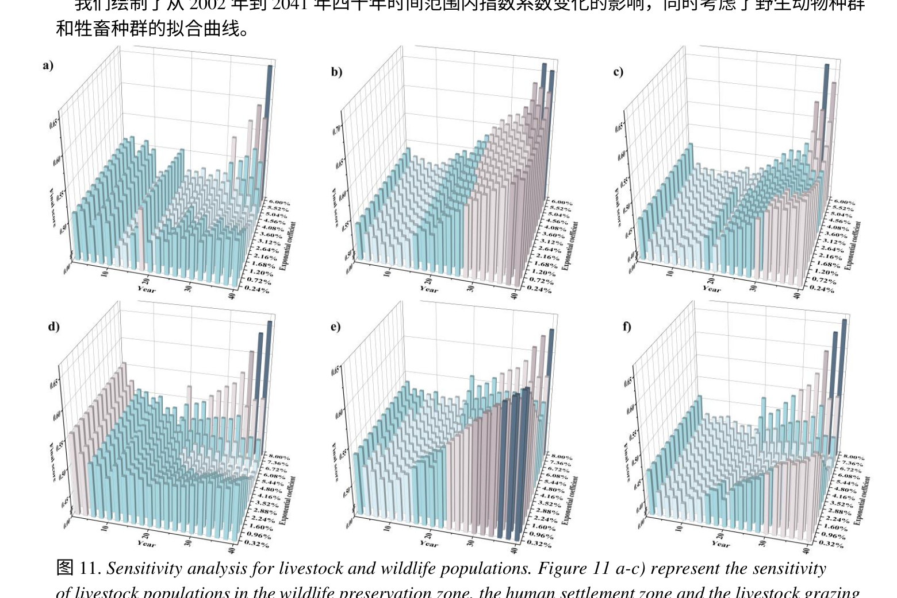

### 图2 野生动物种群的指数拟合曲线。

指数拟合通常为
$$
y=Ae^{-B(t+C)}
$$


找了半天没找到数据，就直接根据图大概写了个数据




#### 实现方法

用指数曲线拟合就行：使用scipy的`scipy.optimize.curve_fit`，进行曲线拟合，把对应函数模型用函数写出来，然后把相应数据写出，调用`curve_fit`函数进行拟合就行

```python
# 定义指数模型函数
def exponential_model(t, A, B, C):
    return A * np.exp(-B * t + C)

# 模拟数据
# t 表示年份，actual_population 表示野生动物总数
t = np.linspace(1, 40, 40)  # 时间点
# 肉眼看的数据，不太准，用真实数据替换
actual_population = [212,415,349,265,165,135,264,210,202,225,237,389,150,215,210,173,112,198,124,146,148,140,105,70,136,130,75,72,69,64,60,56,53,50,48,47,46,45,44,42]

print(len(actual_population))
# 使用 scipy 的 curve_fit 函数进行拟合
params, _ = curve_fit(exponential_model, t, actual_population)
A, B, C = params
```

计算$R^2$就不多说了


#### 结果

结果如下，因为数据的原因，所以结果不太准确，但大致方法步骤类似


### 图3 牲畜种群的线性拟合曲线




同理，线性拟合也可用`curve_fit`

画残差用`fill_between`就行

#### 实现方法

```python
# 定义线性模型函数
def linear_model(t, m, b):
    return m * t + b

# t 表示年份，
t = np.linspace(1, 40, 40)  # 时间点

actual_population = 200 + 10 * t + np.random.normal(0, 20, size=len(t))

# 使用 curve_fit 进行拟合
params, _ = curve_fit(linear_model, t, actual_population)
m, b = params


# 添加随机残差
np.random.seed(42)  # 固定随机种子，确保结果可重复
residuals = np.random.normal(0, 40, size=len(t))  # 正态分布的随机残差，标准差为20
actual_population = actual_population + residuals  # 加入残差后的实际种群数据

# 生成拟合曲线
fitted_population = linear_model(t, m, b)

```

#### 结果


### 图4 不同标准下每月的水分胁迫水平


这个图就是个热力图，只不过是个离散的

在Python中，热力图是一种通过颜色变化来显示数据矩阵中值的大小的可视化方法。热力图常用于展示变量之间的相关性或数据的分布情况。Python中绘制热力图可以使用多个库，其中最常用的是Seaborn库。


Seaborn是基于Matplotlib的高级绘图库，提供了简洁的API来创建各种统计图形。绘制热力图可以使用Seaborn的*heatmap*函数。


### 图5 当地人口和旅游人口的线性拟合曲线




线性拟合同图3，这里不再绘制


> ### 前面没看到不用做，都做了😄


### 图7 不同土地类型中四个部分的权重

百分比柱状图

在Python中，使用matplotlib库可以轻松绘制百分比柱状图。百分比柱状图是一种堆积柱状图，其中每个柱子的高度表示该类别在总数中的百分比。

#### 实现方法

这里用了zt的数据，然后绘制横向的柱状图使用`barh`即可，然后必须加上初始位置，不然图像会重合，在柱状图上加上百分比，用`text`就行，其他没啥好说的

```python
import matplotlib.pyplot as plt
import numpy as np

# 数据
categories = ['Wildlife', 'Human', 'Livestock']
wildlife_protection = [0.510774, 0.136791, 0.157609]
natural_resources_conservation = [0.247575, 0.100906, 0.28744]
local_financial_interest = [0.0631765, 0.351931, 0.118961]
animal_tourism_interactions = [0.178475, 0.410373, 0.43599]

data = [wildlife_protection, natural_resources_conservation, local_financial_interest, animal_tourism_interactions]
labels = ['Wildlife Protection', 'Natural Resources Conservation', 'Local Financial Interest', 'Animal Tourism Interactions']
sums = np.sum(data, axis=0)

# 初始化左侧位置
left_x = np.zeros(len(categories))

# 绘制百分比横向柱状图
for section, label in zip(data, labels):
    x = section / sums
    plt.barh(categories, x, left=left_x, label=label)
    for i, (value, left) in enumerate(zip(x, left_x)):
        plt.text(left + value / 2, i, f'{value:.0%}', ha='center', va='center')
    left_x += x

# 设置标题和显示图形
plt.title('The weight of the four sections in different land types')
plt.xlabel('Weight')
plt.ylabel('Land type')
plt.legend()  # 添加图例
plt.show()
```


#### 结果如下

颜色就直接默认了


<font color=Red>将图例放在图外面，修改后</font>


### 图11 牲畜和野生动物种群的敏感性分析




#### 实现方法

这个图就是个3维条形图，用`bar3d`就可以实现，只是是多张图罢了

```python
import matplotlib.pyplot as plt
import numpy as np

fig = plt.figure(figsize=(18, 10))

# 创建6个子图
for i in range(1, 7):
    ax = fig.add_subplot(2, 3, i, projection='3d')
    _x = np.arange(4)
    _y = np.arange(3)
    _xx, _yy = np.meshgrid(_x, _y)
    x, y = _xx.ravel(), _yy.ravel()

    top = np.random.randint(1, 10, size=len(x))
    bottom = np.zeros_like(top)
    width = depth = 1

    ax.bar3d(x, y, bottom, width, depth, top, shade=True,alpha=0.5)
    ax.set_xlabel('X Label')
    ax.set_ylabel('Y Label')
    ax.set_zlabel('Z Label')
    ax.set_title(f'Graph {chr(96 + i)}')

plt.tight_layout()
plt.show()
```


#### 结果

这里就不弄太复杂的了


<font color=Red>字体能直接修改</font>


